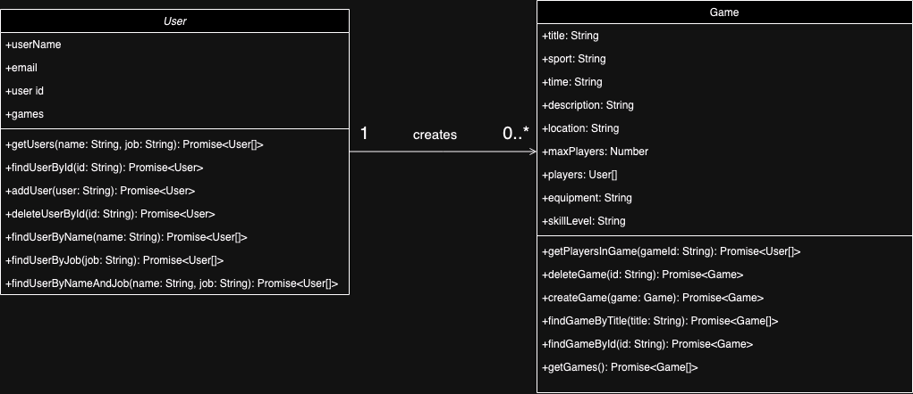

# Pickup Web Application

This application is a webapp designed to connect members of the San Luis Obispo community through sports. Our platform allows users to post local pickup games for others in the community to see, share, and join. We hope that this application will allow users to meet new people, easily schedule events, and to stay active in an organized and safe fashion. 

### Figma
(Last Updated Feb 28, 2024): https://www.figma.com/proto/rhVNr4Xtu3Gk0LYwujeONW/PickUp-StoryBoard?node-id=91-22&starting-point-node-id=91%3A22&mode=design&t=X9BoC5zE1heFxSVa-1

### Dev Environment:

Follow the steps below to start the application after cloning the github repository:

1. Run **npm ci** in the root folder of the repository.
2. In the express-backend folder, create a .env file. Remember to add this to the .gitignore file. In the .env file, add environmental variables for your **MONGODB_URI**, which will allow the backend to run a database, and for the **TOKEN_SECRET**, which will allow the authentication features to access a secret token.
3. In MyApp.js at pickup/packages/react-frontend/src, change the API_URL at the top of the file to localhost.
4. To start the frontend, run **npm run start** (from either the root directory or the react-frontend folder).
5. To start the backend, run **npm run dev** (from either the root directory or the express-backend folder).
6. To lint, run **npm run lint** for eslint, and run **npm run prettier** for prettier.  

### UML Diagrams

### Cypress Testing
We implement Cypress end to end testing. To run the tests, navigate to the main directory and run "npx cypress open" in the terminal. This will pull up a cypress testing window in which you can click on E2E Testing and then "Start E2E Testing in Chrome". This will launch the testing environment. Here, there are 8 seperate testing files that can be run to test that the frontend has appropriate elements as it should and also submits data to the backend to make sure it communicates correctly back with the frontend after data is sent. To run any of the tests simply click on the file in the testing environment window!

Step by step:

1. navigate to main directory (pickup/)
2. run "npx cypress open" in the terminal
3. click "E2E Testing"
4. click "Start E2E Testing in Chrome"
5. click on given test file
